<div align="center">


# Mocha

**Your Claude Code and Codex sessions, in your pocket.**

A personal iPhone app that turns the coding agents running in [Herdr](https://herdr.dev) on my Mac into a native chat.<br>
No cloud, no relay: just the Mac, the phone and a tailnet.


</div>

<p align="center">
  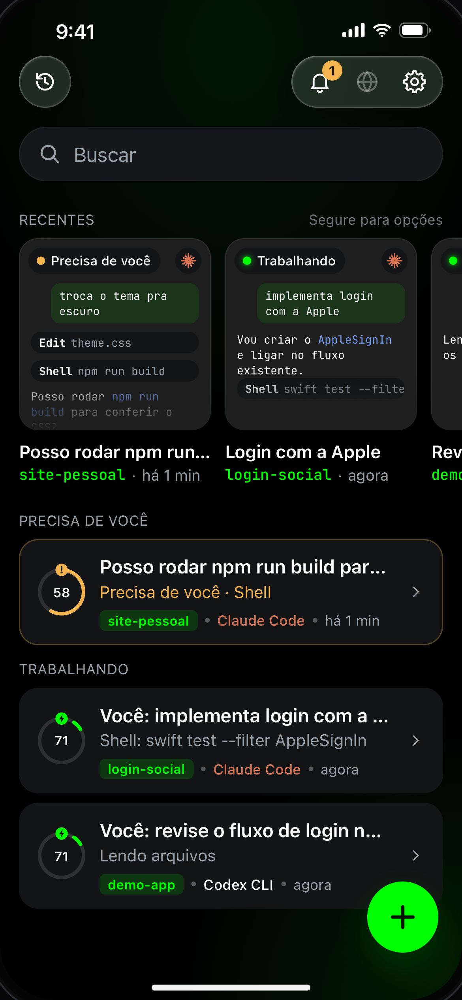
  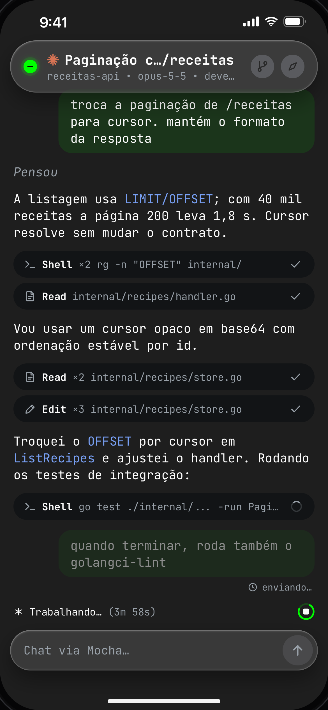
  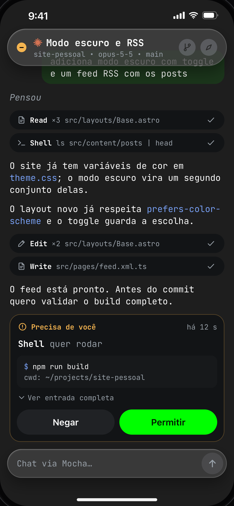
  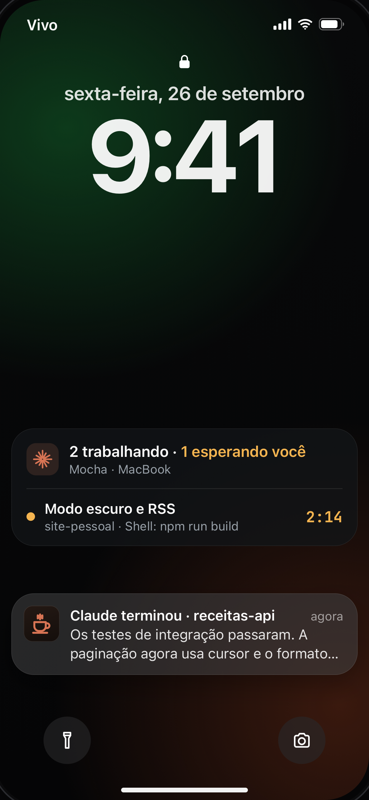
</p>

<p align="center"><sub>Screens from the approved design mock (<a href="docs/design/mock.html"><code>docs/design/mock.html</code></a>), which the app is built to match. The UI is in Brazilian Portuguese.</sub></p>

<details>
<summary><b>More screens</b></summary>
<br>

| Drawer | Subagents | Workflow | Codex |
|:---:|:---:|:---:|:---:|
| 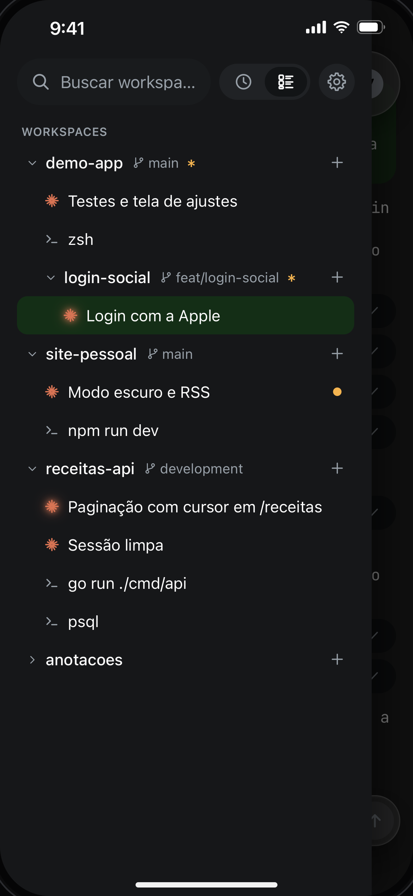 | 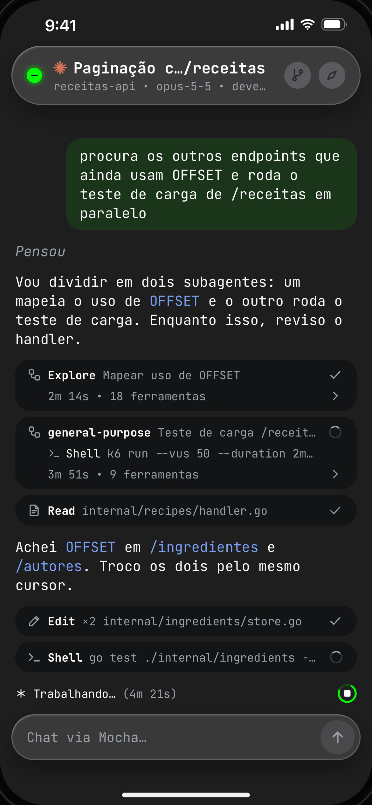 | 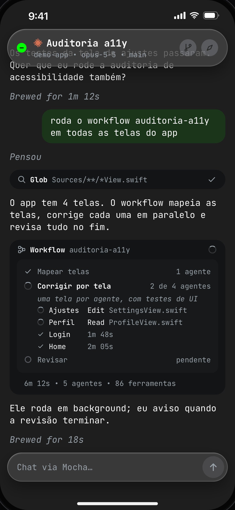 | 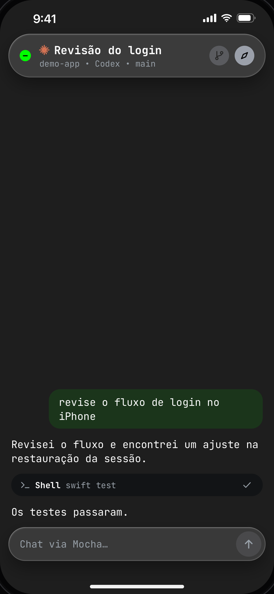 |
| **Questions** | **Slash commands** | **Plan usage** | **History** |
| 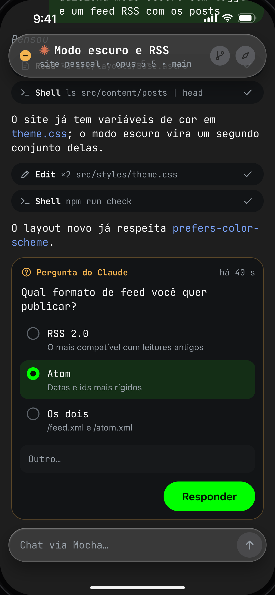 | 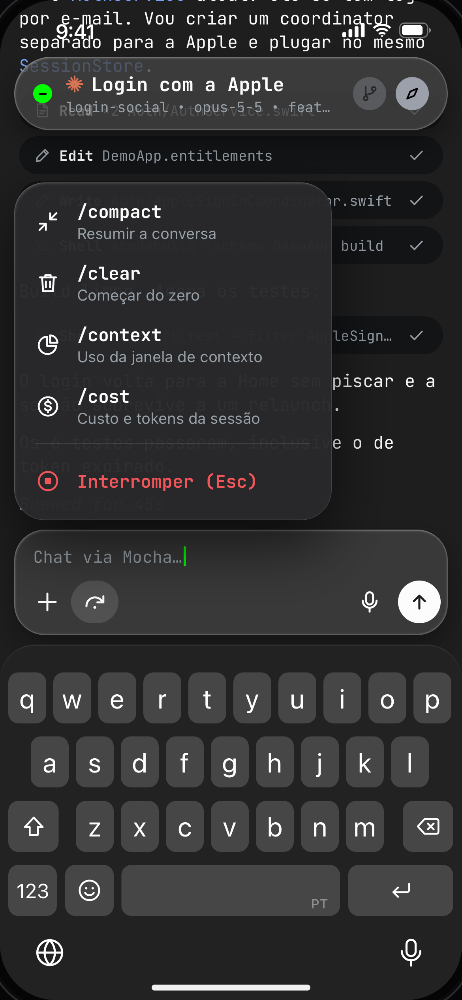 | 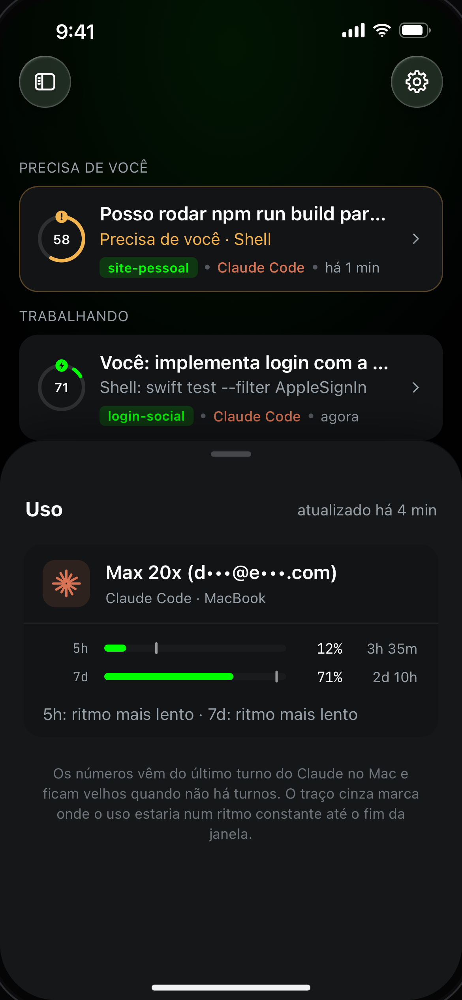 | 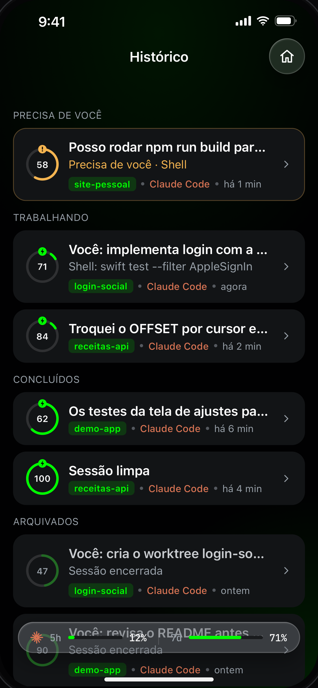 |

</details>

## Features

- **Native agent chat**: live transcript with markdown and tool-call cards. Send prompts, interrupt with Esc, attach photos and dictate in Portuguese, on-device.
- **Claude Code and Codex side by side**: Codex CLI runs through its App Server with the same chat, actions and history. Model, effort and mode controls, `/compact`, `/clear` and plan approval work for both.
- **Approvals and questions**: answer permission prompts and multi-step questions from the chat, the inbox, a notification or the Lock Screen.
- **Subagents and workflows**: a live card for each subagent opens its own transcript, and workflows show their phases and agents.
- **Push and Live Activity**: one Live Activity follows the agent that needs you. It stays quiet while you are at the Mac and nudges you once you lock it. Pushes go from the Mac straight to APNs.
- **Herdr-aware**: workspaces, worktrees, tabs and live agent status. Open a new Claude or Codex tab from the phone.
- **Usage at a glance**: the 5-hour and weekly plan windows, plus the context left for each agent.
- **Web preview**: dev servers running on the Mac show up in the app and open on the iPhone through an SSH tunnel.
- **Tailnet only**: the daemon listens on `127.0.0.1` and reaches the phone only through `tailscale serve`. Devices pair with a QR code.

Not on the App Store. Built for a single user and a single Mac.

## How it works

```
iPhone ─ Mocha (SwiftUI) + MochaWidgets (Live Activity)
   │
   │  wss over Tailscale  (tailscale serve → 127.0.0.1)
   ▼
Mac ─ mochad (Swift LaunchAgent)
   ├─ Herdr socket API     workspaces, tabs, panes, agent status
   ├─ Claude Code JSONL    chat history, live tail, subagents
   ├─ Claude Code hooks    turn done, approvals, questions
   ├─ Codex App Server     threads, turns, approvals
   └─ APNs over HTTP/2     alerts and Live Activity, no relay
```

- **The Mac is the source of truth.** The app keeps no chat history of its own and asks the daemon again on every launch.
- **No open ports.** Nothing listens outside `127.0.0.1`; `tailscale serve` is the only way in.
- **No cloud.** Pushes go from the Mac straight to APNs.
- **Background means push.** With the app closed there is no live connection: push covers the gap, and the app catches up when it opens.

## Repository

| Path | What lives there |
|---|---|
| [`App/`](App) | The SwiftUI app (iOS 26+) |
| [`Widgets/`](Widgets) | Live Activity and Dynamic Island extension |
| [`Shared/`](Shared) | Live Activity intents shared by the app and the extension |
| [`MochaKit/`](MochaKit) | Swift package with the protocol, the client and the daemon |
| [`scripts/`](scripts) | Bootstrap, test, build and update-check scripts |
| [`docs/`](docs) | Spec, plan, spikes and the design mock |

<details>
<summary><b>MochaKit modules</b></summary>
<br>

| Module | Role |
|---|---|
| `MochaProtocol` | Types shared by the app and the daemon (protocol v1) |
| `MochaClient` | The app's WebSocket client, reconnection and presentation logic |
| `MochaDemo` | In-process fake server for demo mode and UI work |
| `MochaTranscript` | Claude Code JSONL parser |
| `MochaHerdr` | Herdr socket client |
| `MochaDaemonCore` | Daemon services: gateway, session hub, hooks, push, Codex |
| `mochad` | The daemon executable and CLI |
| `MochaTestSupport` | Fakes and helpers for the tests |

</details>

## Getting started

Mocha assumes one Mac and one iPhone. You need:

- Xcode 27 and [XcodeGen](https://github.com/yonaskolb/XcodeGen)
- [Herdr](https://herdr.dev) running Claude Code and/or the Codex CLI
- Tailscale on both devices, with HTTPS certificates enabled
- A paid Apple Developer account and an APNs key (`.p8`) for push

**App**

```bash
scripts/bootstrap.sh       # creates Config/Signing.xcconfig and generates Mocha.xcodeproj
# set DEVELOPMENT_TEAM and MOCHA_BUNDLE_ID in Config/Signing.xcconfig
scripts/test.sh            # MochaKit tests (Swift Testing)
scripts/build-device.sh    # signed build for the iPhone
```

> [!TIP]
> No Mac set up yet? The **Mocha Demo** scheme launches the app with `-demo` and runs it on fake data, no daemon needed.

**Daemon**

```bash
scripts/build-daemon.sh                  # signed release build; prints the binary path
<binary path> install                    # copies to ~/.local/bin/mochad and loads the LaunchAgent
mochad serve-setup --apply               # exposes the gateway on the tailnet
mochad install-hooks                     # registers the Claude Code hooks
mochad apns import AuthKey.p8 --key-id <KID> --team-id <TID> --bundle-id <bundle id>
mochad pair                              # prints a QR code to scan from the app
mochad doctor                            # health check
```

**Staying in sync with the agents**

Claude Code and Codex screens, hooks and transcripts are not a stable contract. When a new version ships, `scripts/check-claude-update.sh` and `scripts/check-codex-update.sh` rerun the integration suites against the real CLI in a lab workspace and bump the validated version only if everything passes.

## Status

| Phase | Status |
|---|---|
| Foundation, protocol and technical spikes | Done |
| Pairing, chat, drawer, images, push, slash commands and new tabs | Done |
| Subagents and workflows | Done |
| Approvals inbox, Live Activity and voice | Done |
| Web preview, model and effort controls, native image attachments | Done |
| Codex CLI on par with Claude Code | Done |
| Alerts: Live Activity as the single channel, quiet while at the Mac | Done |
| SSH terminal | Next |
| Mosh | Next |

## Built with agents

Mocha is built by Claude Code itself. An orchestrator session splits each phase into work packages and hands them to subagents, each in its own Herdr worktree. Every package follows the spec and must pass its acceptance criteria before it is merged.

| Doc | What it is |
|---|---|
| [`docs/SPEC.md`](docs/SPEC.md) | Source of truth: product, architecture, protocol and design system (PT-BR) |
| [`docs/PLANO.md`](docs/PLANO.md) | Phases, work packages, acceptance criteria and status (PT-BR) |
| [`AGENTS.md`](AGENTS.md) | Rules for the orchestrator and the subagents (PT-BR) |
| [`prompts/orquestrador.md`](prompts/orquestrador.md) | Kickoff prompt for the orchestrator session |

## Credits

[swift-markdown](https://github.com/swiftlang/swift-markdown) renders the chat, [Citadel](https://github.com/orlandos-nl/Citadel) powers the SSH tunnel, and [JetBrains Mono](https://github.com/JetBrains/JetBrainsMono) is the monospace font.

<sub>Mocha is a personal project, not affiliated with Anthropic, OpenAI, Herdr or Tailscale.</sub>
